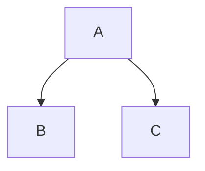

# Headline Level 1
Headline Level 1
=

# Learning Git and GitHub
This is the repository for the LinkedIn Learning course Learning Git and GitHub. The full course is available from [LinkedIn Learning][lil-course-url].

![Learning Git and GitHub][lil-thumbnail-url] 

Version Control lets you manage changes you've made to files over time, and is an essential skill for developers to master. Git is by far the most popular version control system on the web. In this fast-paced course, Ray Villalobos shows you the fundamental commands that you need to work with most Git projects. He explains how to use checkpoints called commits, which let you leave messages documenting what happened at each checkpoint, as well as how to create branches that are alternate versions of your project that you can work on without changing the original. Plus, he shows how to work with the popular GitHub website to explore existing projects, clone them to your local hard drive, and use them as templates for your new projects.

## Instructions
This repository has branches for each of the videos in the course. You can use the branch pop up menu in github to switch to a specific branch and take a look at the course at that stage, or you can add `/tree/BRANCH_NAME` to the URL to go to the branch you want to access.

## Branches
The branches are structured to correspond to the videos in the course. The naming convention is `CHAPTER#_MOVIE#`. As an example, the branch named `02_03` corresponds to the second chapter and the third video in that chapter. 
Some branches will have a beginning and an end state. These are marked with the letters `b` for "beginning" and `e` for "end". The `b` branch contains the code as it is at the beginning of the movie. The `e` branch contains the code as it is at the end of the movie. The `main` branch holds the final state of the code when in the course.

When switching from one exercise files branch to the next after making changes to the files, you may get a message like this:

    error: Your local changes to the following files would be overwritten by checkout:        [files]
    Please commit your changes or stash them before you switch branches.
    Aborting

To resolve this issue:
	
    Add changes to git using this command: git add .
	Commit changes using this command: git commit -m "some message"


                            

Check out my other courses on [LinkedIn Learning](https://www.linkedin.com/learning/instructors/ray-villalobos).

[lil-course-url]: https://www.linkedin.com/learning/learning-git-and-github-14213624
[lil-thumbnail-url]: https://cdn.lynda.com/course/2421501/2421501-1629911102468-16x9.jpg

### Instructor

Ray Villalobos 
                            
Author, Multimedia Developer

***
# Frank's notes

# Headline Level 1
Also Headline Leve 1
====================

Subheadline Level 2
---
# Headline Leven 1
## Headline Leven 2
### Headline Leven 3
#### Headline Leven 4
##### Headline Leven 5
##### Headline Leven 6

Special Styles
===============

**bold**
__bold__
*italic*
_italic_
~~strike through~~

**_In Markdown kannst du für einen Zeilenumbruch entweder zwei Leerzeichen am Ende der Zeile einfügen oder einen HTML-Zeilenumbruch (<br>) verwenden._**

> this is a quotation: ölasdföalsdfjöalskdfj  
> asdölkfjaslkdasdölkfjasöldkfjasf  
> asdlfkjasdölfjasdlökfjasdölfkasdjfölksadasödlkfj  


## Footnotes


### This is a footnote[^1]. Another footnote[^2].


[^1]: My reference
[^2]: Another footnote


___
Linie
***
Linie
___
Linie


$$ x^2 $$


**Indentation with two spaces!!!!**
1. item
2. item
   subitem
   subitem2


## LINKS


OjO: reference links

>Version Control lets you manage changes you've made to files over time, and is an essential skill for developers to master. Git is by far the most popular version control system on the web. In this fast-paced course, Ray Villalobos shows you >the fundamental commands that you need to work with most Git projects. **_LinkedIn_**  
>[LinkedIn]  
>
[LinkedIn](https://linkedin.com)

OjO: der link in der quote funktioniert nicht; FZ: checken

## Images


creating an image link:

[](https://raybo.org)  


## Code

for some code put some tickmarks ``` or a code block

He explains how to use checkpoints called commits, which let you leave messages documenting what happened at each checkpoint,  
as well as how to create branches that are alternate versions of your project that you can work on without changing the original. 
Plus, he shows how to work with the popular `''GitHub website to explore existing projects''`, clone them to your local hard drive, and use them as templates for your new projects.  

code block = 3 thickmarks

```
let x = 5;
console.log(x);
```
as it is javascript:

```js
let x = 5;
console.log(x);
```

## Tables

| Left  | Center| Right  |
|------ | :---: | -----: |
| One	| Two   | $1.00  |
|Three  | Four  | $120.00|
| Five  | Six   | $.99   | 

## Task List

- [x] First
  - [ ] One
  - [ ] Two
- [ ] Second	

## Special Additions


### Emojis

list of emojis with ":"
🥉
💙

## Mermaid




